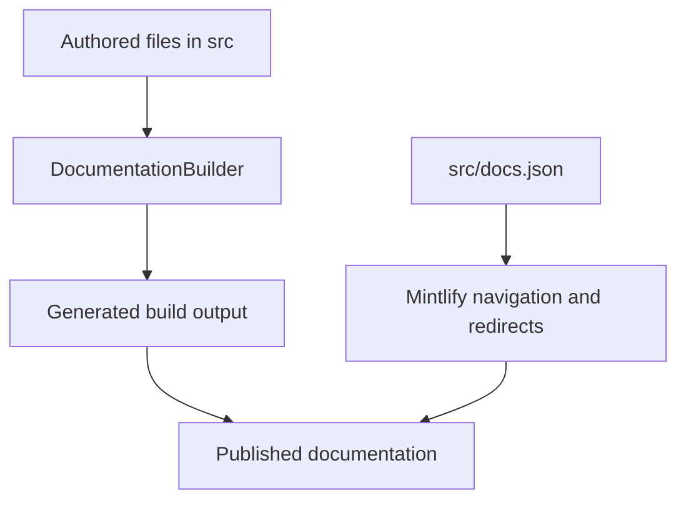

`src/` is the authoritative authored documentation tree. Route emission and visible navigation are separate contracts: `pipeline/core/builder.py` selects and transforms source files into generated output, while `src/docs.json` assigns emitted routes to Mintlify products, menu items, dropdowns, tabs, groups, and redirects. Never treat `build/` as a source of truth or edit it.

The diagram separates the two ownership boundaries: the builder determines which route files exist, and `docs.json` determines where those routes appear and which old URLs redirect.

## Route ownership

| Authored domain | Emitted route family | Typical navigation placement |
| --- | --- | --- |
| `src/index.mdx` | `/` | Lifecycle → Home |
| Shared `src/oss/langchain/`, `src/oss/langgraph/`, and `src/oss/deepagents/` | `/oss/python/...` and `/oss/javascript/...` | Lifecycle → Build language dropdowns |
| `src/oss/python/` | `/oss/python/...` with `python/` removed after the language segment | Build → Python |
| `src/oss/javascript/` | `/oss/javascript/...` with `javascript/` removed after the language segment | Build → TypeScript |
| `src/oss/openwiki/` | `/oss/openwiki/...` once | Build → OpenWiki |
| `src/oss/deepagents/code/` | `/oss/deepagents/code/...` once | Products and setup → Deep Agents Code |
| Direct `src/langsmith/*.mdx`, except Managed Deep Agents | `/langsmith/...` | Test, Deploy, Monitor, or Products and setup as configured |
| Direct `src/langsmith/managed-deep-agents*.mdx` | `/langsmith/python/...` and `/langsmith/javascript/...` | Build → Managed Deep Agents |
| `src/langsmith/fleet/` | `/langsmith/fleet/...` | Products and setup → No-code agents |
| `src/snippets/` | imported MDX components, not public routes | Referenced by authored pages |

Most OSS material is emitted twice. The builder includes `oss/python/` only in Python output and `oss/javascript/` only in JavaScript output; shared OSS sources are processed for both targets, resolving `:::python` and `:::js` content per target. OpenWiki and Deep Agents Code are deliberate exceptions: each emits once at its unversioned product root, using the Python conditional-content branch.

Directory names are not navigation labels. In particular, `src/langsmith/fleet/` remains the source and URL namespace even though readers see **No-code agents**. Likewise, flat LangSmith files are organized by functional topic, but their lifecycle or product placement is wholly controlled by `docs.json`.

## Navigation map

`docs.json` defines two top-level products:

- **AGENT DEVELOPMENT LIFECYCLE**: **Home**, **Build**, **Test**, **Deploy**, and **Monitor**. Build has Python and TypeScript dropdowns, each with ten tabs. Test, Deploy, and Monitor use flat tabs backed primarily by direct `src/langsmith/` files, rather than language-specific source trees.
- **PRODUCTS AND SETUP**: **LangSmith setup**, **LLM Gateway**, **No-code agents**, **Engine**, and **Deep Agents Code**. LangSmith setup is the menu item with tabs; the other items are page and group lists.

This is a placement rule, not a route-generation rule: adding a page normally needs both an authored MDX file and the matching `docs.json` navigation entry. When moving a public route, add or retain a redirect instead of keeping a duplicate source page.

### Managed Deep Agents

A direct LangSmith `.md` or `.mdx` file whose name starts `managed-deep-agents` is handled separately from ordinary LangSmith content. The builder emits Python and JavaScript variants, and `docs.json` redirects unversioned Managed Deep Agents URLs to Python. The Managed Deep Agents tab appears in both Build dropdowns with **Get started** (Beta), **Agent capabilities**, and **Build and deploy** groups.

The authored overview establishes the product boundary: users provide the agent's instructions, tools, skills, and model, while MDA supplies the Deep Agents harness and a managed Agent Server runtime. The shared project-structure source then resolves language fences into variants. Each needs one root named `agent` export (`agent.py` / `define_deep_agent` for Python or `agent.ts` or `agent.tsx` / `defineDeepAgent` for TypeScript); declared paths enable managed context, channels, schedules, connectors, and related capabilities. Keep the source flat under `src/langsmith/`; language duplication happens at build time.

### LLM Gateway governance

LLM Gateway is a Beta **Products and setup** item backed by flat `src/langsmith/llm-gateway*.mdx` files. Navigation groups its pages as **Core capabilities**, **Administration and governance**, and **Advanced**. Model fallbacks belongs in Core capabilities; access, monitoring, spend, rate-limit, model-access, header, and data policies belong in Administration and governance.

A fallback chain is workspace-scoped and pairs one primary provider/model with one to five ordered backup models and trigger statuses. On a configured upstream status or transport error, the gateway tries backups in order; it stops on success, a non-triggering response, or exhaustion, returning the response in the client API format. Each attempt is independently traced and counted for spend policy purposes. Creating chains requires `organization:manage`.

Model-access policies are the complementary admission boundary: an applicable policy denies a provider or model absent from its allow-list with `403`. Only the most-specific matching scope applies—API key, user, workspace, then organization—and policies at one scope intersect. They take effect immediately; custom providers are not supported by these policies.

### Webhook surfaces are distinct

Do not collapse the two pages merely because both deliver POST requests:

- `use-webhooks.mdx` is an **Agent Server** capability in Deploy. A caller supplies a `webhook` parameter to supported run or cron POST operations, and LangSmith posts the completed run to that URL. The payload is a run representation and can include stateful checkpoint values and error data.
- `webhooks.mdx` is under Monitor → Observe → Automations. It configures a webhook action on a LangSmith automation rule; delivery is a polling-window batch of matching runs *or* threads, never both. Consumers must iterate the delivered array and should authenticate incoming callbacks with a secret query parameter.

## Generated OpenAPI boundaries

Mintlify generates endpoint pages at deployment time from navigation `openapi` blocks; those operation pages are not authored MDX files and do not appear as local route files. Three navigation sections establish the inputs and output roots:

| Navigation location | Specification owner | Generated route root |
| --- | --- | --- |
| Deploy → Get started → Reference → Agent Server API | committed `src/langsmith/agent-server-openapi.json` | `/langsmith/agent-server-api/` |
| Deploy → Get started → Reference → Control Plane API | remote `https://api.host.langchain.com/openapi.json` | `/api-reference/` |
| Monitor → Reference → LangSmith REST API | generated committed `src/langsmith/langsmith-platform-openapi.json` | `/langsmith/smith-api/` |

The builder derives generated operation entries from `docs.json` and a local spec for `llms.txt`; it skips a configured source that is missing, outside the build root, or invalid, and skips `x-hidden` operations. The remote Control Plane spec therefore remains deployment-time only. `langsmith-platform-openapi.json` is itself generated: a daily workflow fetches and processes the public spec, then opens or appends to one standing refresh PR. Do not hand-edit it. `make check-openapi` currently validates the local Agent Server specification after building; it is not coverage for all three sources.

## Transformation and safety invariants

For a language target, the builder preprocesses MDX, rewrites versioned snippet imports, rewrites unqualified `/oss/` links to the applicable language route unless already qualified or in an unversioned product, and rewrites unversioned Managed Deep Agents links to that target's route. This is why source links can be concise without making one language output point at the other.

Source discovery rejects symlinks and paths resolving outside the collection root, so a committed source path cannot include arbitrary host files in output. Focused tests cover language-prefix link rewriting, unversioned OSS output, Managed Deep Agents dual routes, and symlink exclusion.

## Safe change checklist

1. Choose the authored owner from the route map, not from a desired navigation label.
2. Update the MDX source and its exact product, menu item, dropdown or tab, and group in `src/docs.json`.
3. Preserve redirects for moved public routes; do not duplicate authored content to maintain an old URL.
4. For shared OSS and Managed Deep Agents, inspect both output variants and rewritten links. For OpenWiki and Deep Agents Code, verify only the unversioned route exists.
5. Run `make build` and `make broken-links`; use `make check-openapi` for Agent Server spec changes. Do not edit generated build output or the processed LangSmith Platform spec.

## Related pages

- [Build system architecture](/openwiki/architecture/build-system.md)
- [Versioning](/openwiki/concepts/versioning.md)
- [Mintlify integration](/openwiki/integrations/mintlify.md)
- [Reference docs](/openwiki/integrations/reference-docs.md)
- [Adding pages](/openwiki/operations/adding-pages.md)
- [Versioned content workflow](/openwiki/workflows/versioned-content.md)
