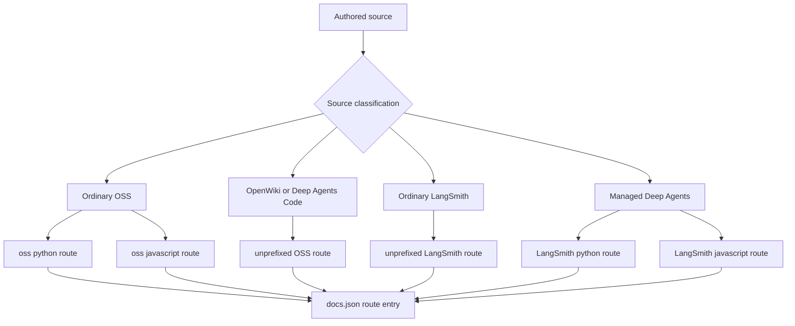
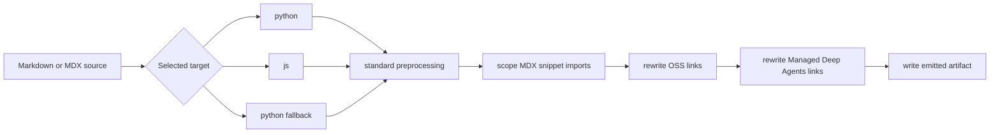

# Language Versioning Strategy

Language versioning is a build and navigation model, not a source-tree naming convention. A source location determines how `DocumentationBuilder` renders an artifact; that render determines its emitted route; and `src/docs.json` independently determines which emitted routes navigation exposes and which retired URLs redirect. Keep authored source, emitted route, and navigation/redirect configuration as separate contracts.

## Route families start with source classification

| Authored source domain | Emitted route family | Navigation consequence |
| --- | --- | --- |
| Most `src/oss/` content, including LangChain, LangGraph, and Deep Agents except `code/` | `/oss/python/...` and `/oss/javascript/...` | Add each emitted route to its Python or TypeScript Build dropdown. |
| `src/oss/python/` or `src/oss/javascript/` | Only its matching `/oss/python/...` or `/oss/javascript/...` route; the leading source-language directory is removed | Add the route only to its matching dropdown. |
| `src/oss/deepagents/code/` | `/oss/deepagents/code/...` | One language-agnostic, unprefixed product route. |
| `src/oss/openwiki/` | `/oss/openwiki/...` | One unprefixed product route; the same routes appear in both Build dropdowns. |
| Ordinary `src/langsmith/` content | `/langsmith/...` | Configure it in the applicable LangSmith navigation group; this route family is not inherently language-split. |
| A direct `src/langsmith/managed-deep-agents*.mdx` page | `/langsmith/python/...` and `/langsmith/javascript/...` | Add both emitted routes to the Managed Deep Agents tab in the corresponding Build dropdown. |

For example, `src/oss/langgraph/overview.mdx` produces two artifacts. In contrast, `src/oss/python/integrations/chat/example.mdx` is emitted only in the Python pass as `/oss/python/integrations/chat/example`. Do not create generated language copies to resemble emitted routes.



The diagram shows builder-owned emission followed by independently configured navigation; `docs.json` does not generate pages.

## Build lifecycle and rendering order

`build_all()` removes any existing `build/` directory before it renders Python OSS, JavaScript OSS, unversioned Deep Agents Code, unversioned OpenWiki, ordinary LangSmith, and Managed Deep Agents variants. It then copies shared files and npm snippets and generates `llms.txt` and `llms-full.txt`. A full build is therefore the appropriate operation after broad route changes because it eliminates stale output before derived indexes are generated.

For each Markdown or MDX artifact, standard preprocessing runs first. With a target language, the builder then scopes MDX snippet imports, rewrites OSS links, and finally rewrites Managed Deep Agents links. Internal target `js` maps to the public URL segment `javascript`; a `.md` input is written as an `.mdx` artifact.



The diagram shows the processing sequence for one emitted Markdown artifact; it does not modify authored content under `src/`.

`build_file()` makes the corresponding routing decision for one existing input: ordinary OSS gets both variants, the unversioned OSS products get one artifact, and a Managed Deep Agents input gets both language artifacts. Shared and root-level inputs copy once. A missing file raises `AssertionError`.

## Shared OSS and language-specific material

Shared OSS is the normal dual-version case. A shared page renders once for `python` at `/oss/python/...` and once for `js` at `/oss/javascript/...`; unqualified absolute OSS links therefore follow the current artifact's language.

The `src/oss/python/` and `src/oss/javascript/` subtrees instead contain language-specific material. The versioned build includes each file only in its matching pass and removes that leading directory from the output path. Use these directories when content truly exists for one language, rather than duplicating shared source.

## Intentional unversioned OSS products

Deep Agents Code and OpenWiki are explicit exceptions inside `src/oss/`. They emit once at `/oss/deepagents/code/...` and `/oss/openwiki/...`. Both use `python` as the deterministic target for conditional blocks; that fallback does not make either product Python documentation, and their own links remain unprefixed.

The fallback still controls links to ordinary versioned OSS. Thus, an unqualified `/oss/deepagents/quickstart` link from either unversioned product becomes `/oss/python/deepagents/quickstart`. This is a target-based link decision, not a second version of the unversioned product.

## Managed Deep Agents: unversioned source, dual output

Managed Deep Agents is the LangSmith exception. A direct file under `src/langsmith/` with a `managed-deep-agents` filename prefix and either `.md` or `.mdx` extension is classified as Managed Deep Agents. The ordinary LangSmith pass excludes classified pages, so no unversioned page artifact is emitted alongside the language routes.

The dedicated full-build pass discovers only `managed-deep-agents*.mdx` files and renders Python and JavaScript variants. `build_file()` recognizes both extensions, which means it can emit a `.md` page on demand even though the bulk pass does not discover one. Use `.mdx` for a Managed Deep Agents page that must appear after a normal full build.

Each variant receives matching conditional content, scoped snippet imports, OSS links, and Managed Deep Agents cross-links. The overview and project-structure sources illustrate this model: both contain `:::python` and `:::js` content and unqualified Managed Deep Agents links or snippet imports, allowing each emitted artifact to retain its own language material and refer to sibling pages in the same route family.

Unprefixed and historical Managed Deep Agents URLs are redirect-only compatibility routes in `src/docs.json`; current redirects send them to Python routes. The same file separately lists Python and TypeScript Managed Deep Agents routes in their respective Build dropdowns. When adding, renaming, or removing one of these pages, keep the source naming rule, both emitted navigation routes, and applicable legacy redirects synchronized.

## Conditional-content contract

Use `:::python` and `:::js` only where a shared source requires different material:

```markdown
:::python
Python-only content.
:::

:::js
JavaScript-only content.
:::
```

For the selected target, preprocessing removes the fences and retains the matching content; it removes a nonmatching supported block. Unsupported labels and unclosed blocks remain unchanged. The opening and closing markers must use matching indentation. Escape a literal marker as `\:::` when output must show conditional syntax.

Conditional rendering is regex-based and not code-fence-aware. Do not depend on a Markdown code fence to protect conditional-looking syntax, and do not nest conditionals: the first eligible closing marker ends the match. Escape both markers when documenting the syntax literally.

## Link and snippet rewrite contract

Author an unqualified absolute OSS link when the destination should follow the active language. For example, `/oss/langgraph/overview` becomes `/oss/python/langgraph/overview` in Python output and `/oss/javascript/langgraph/overview` in JavaScript output. The rewriter preserves already-prefixed URLs, paths containing `images`, and Deep Agents Code and OpenWiki roots. These exclusions prevent double prefixes and preserve product routes with no language variants.

In a versioned page, import a Markdown snippet from its unprefixed source path:

```mdx
import Example from '/snippets/example.mdx'
```

The builder rewrites that import to `/snippets/python/example.mdx` or `/snippets/javascript/example.mdx`. It leaves already scoped imports unchanged; imports of JSX and TSX components do not match the Markdown-import rewrite. Language-scoped snippet copies let consumers at different route depths resolve the appropriate snippet consistently.

Bare `/langsmith/managed-deep-agents...` links are also rewritten during a target-language render. Explicitly language-qualified links are preserved, so use one only when the destination must be a particular variant rather than follow the current artifact.

## Navigation and safe changes

`src/docs.json` is navigation and redirect configuration, not authored documentation or build output. It independently assigns Python and TypeScript routes to their Build dropdowns, including separate Managed Deep Agents entries, while the unprefixed OpenWiki family appears in both dropdowns. Use extensionless emitted routes in this configuration, not `src/` paths or `.mdx` filenames.

When changing language routing:

1. Choose the source domain from the intended public route and language behavior, not from a navigation label alone.
2. Change authored content under `src/`; never edit generated `build/` output.
3. Add each extensionless emitted route to the appropriate `docs.json` product, menu, dropdown, tab, and group.
4. Preserve public moves with a `docs.json` redirect, retaining any language prefix in the retired URL.
5. Run `make build`, inspect both artifacts for versioned content, then run `make broken-links`. Update focused builder coverage when classification, exemptions, snippet scoping, or Managed Deep Agents behavior changes.

## Focused regression coverage

`tests/unit_tests/test_builder.py` covers the boundaries most likely to regress: ordinary OSS prefix insertion; preservation of qualified and unversioned-product links; one-time output for the two unversioned OSS products; language-scoped MDX imports; and Managed Deep Agents dual output. The Managed Deep Agents fixture verifies language-specific page links, OSS links, scoped snippets, and conditional snippet content in both variants, as well as absence of unversioned Managed Deep Agents artifacts.

## See also

- [Build system](/openwiki/architecture/build-system.md)
- [Source directory map](/openwiki/architecture/source-map.md)
- [Markdown preprocessing pipeline](/openwiki/concepts/preprocessing.md)
- [Adding pages](/openwiki/operations/adding-pages.md)
- [Conditional rendering tests](/openwiki/testing/conditional-rendering.md)
- [Writing versioned content](/openwiki/workflows/versioned-content.md)
