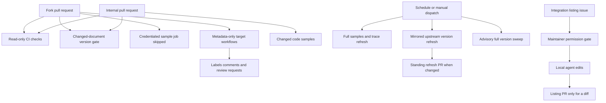

## Topology and trust boundary

GitHub Actions has two distinct execution classes. Ordinary `pull_request` jobs validate the submitted revision and may check out its code, but must not give fork-provided code secrets or repository-write authority. Scheduled, manual, and maintainer-gated workflows run in the trusted repository context and may hold credentials or create branches, pull requests, comments, or external tickets. A `pull_request_target` workflow is also privileged: it may operate on PR metadata, but must not check out or execute the fork head.



This diagram shows the trust boundary and the principal version-maintenance paths. A version rewrite is a repository change proposed for review; it is not evidence that the surrounding requirement prose remains correct.

## Pull-request validation

### Core CI and generated content

`ci.yml` runs reusable test, lint, and documentation-link workflows plus merge-conflict, cross-reference, external documentation URL, and generated-file checks on pull requests and pushes to `main`; it can also be dispatched manually. Its workflow-and-ref concurrency group cancels an obsolete in-progress run when a newer push arrives.

The URL gate is write-free: `uv run python scripts/refresh_integration_downloads.py --check-docs-urls` permits only `http(s)` or single-slash site-relative external-listing `docs_url` values. The generator repeats the safety check before it renders Markdown links. The generated-file job reruns `pipeline/tools/partner_pkg_table.py` and fails when the checked-in provider overview differs; it skips expected `github-actions[bot]` package-download update PRs and PRs labeled `bypass-auto-check`.

Useful local equivalents are:

```bash
make test
make lint
make broken-links-with-anchors
make check-cross-refs
uv run python scripts/refresh_integration_downloads.py --check-docs-urls
uv run python pipeline/tools/partner_pkg_table.py
```

### Changed-document version claims

`check-version-claims.yml` is a separate, read-only `pull_request` gate. It is triggered by documentation, validator, ignore-list, or workflow changes. It uses a full checkout to find added, copied, modified, renamed, type-changed, unmerged, or unknown-status `.mdx` files under `src/` since the merge base with the PR base branch. When no such documents changed, it records a zero count and does not set up Python or invoke the checker.

For changed documents, it pipes the selected paths to `scripts/check_version_claims.py --files`. The checker extracts `>=` and `==` package specifiers, chooses PyPI or npm from package syntax, nearby language labels, fenced language, and page path, then queries the relevant registry concurrently. It blocks only a named version that was never published. A shortened version is accepted when a published release has that version prefix; intentionally old floors are not upgraded or rejected merely for being old.

Registry lookup failures, including an outage or private/unavailable package, are reported as unresolved notes rather than bad-version failures. The ignore list can suppress a known-good non-resolving specifier. Thus this gate establishes publishability of the literal versions in changed docs, not that a minimum version is semantically appropriate for a feature.

Run it locally against all docs, selected pages, or as a non-blocking report:

```bash
uv run python scripts/check_version_claims.py
uv run python scripts/check_version_claims.py --files src/langsmith/evaluators.mdx
uv run python scripts/check_version_claims.py --advisory-only
```

See [Version Claim Validation](/openwiki/operations/version-claim-validation.md) for author-facing interpretation and [Testing Overview](/openwiki/testing/test-overview.md) for the broader CI suite.

### Code samples

`test-code-samples.yml` runs only for code-sample or workflow-file PR changes, manual dispatch, and a monthly schedule. Its credential-dependent job explicitly skips fork PRs. Internal PRs test only changed supported sample files; manual and scheduled runs test all samples. Persistent LangSmith 429 responses are retried up to three attempts and then treated as skipped, while ordinary sample or trace-collection failures fail the run.

Monthly and manual full runs enable LangSmith tracing. After successful tests, they regenerate snippet MDX and maintain a trace-refresh PR only if the trace manifest or generated snippets differ. Publication is limited to single-snippet source files: multi-snippet files are recorded as skipped, while an agent-like LangSmith root run is publicly shared and written to the trace-link manifest. This is a trusted write path, not a fork validation path. See [Code Sample Lifecycle](/openwiki/workflows/code-sample-lifecycle.md).

## Privileged PR metadata and maintainer automation

PR-facing label, welcome, and external-integration workflows use `pull_request_target` to read trusted base-ref policy and GitHub API metadata without checking out or executing an untrusted head. The labeler delegates synchronized path labels to `.github/labeler.yml`, leaving the protected `internal` and `external` labels unsynchronized. The welcome workflow applies the last matching `OWNERS` rule, optionally requests opted-in owners, and posts an ownership summary. The external-integration workflow labels qualifying external contributions and posts one idempotent listing-form nudge while reading only changed-file metadata and candidate MDX front matter through the API.

Integration listing automation starts only from manual dispatch or a maintainer-applied `integration-run` label. It verifies write-level repository permission before checkout; an unauthorized label event removes the label and comments on the issue. Once authorized, it parses issue-form headings into JSON without evaluating field values, restricts untrusted values to listing metadata and local edits, and creates and links an integration PR only if the agent produced changes. See [Integration Listing Automation](/openwiki/workflows/integration-listing-automation.md).

## Scheduled maintenance

### Mirrored upstream version requirements

`refresh-external-versions.yml` runs at 08:00 UTC every Monday and on manual dispatch. Its `refresh` job has `contents: write` and `pull-requests: write`, runs `scripts/check_external_versions.py --write`, and uses `scripts/data/external_versions.yaml` as the allowlisted registry of mirror claims. An entry identifies one `src/` page, a page pattern that must match exactly once and captures only the version, and either a GitHub file pattern or latest GitHub release as the upstream authority. Registry validation prevents unsafe repository paths and URL components.

The script fetches each upstream value and substitutes only the captured version digits when it differs. If upstream is unavailable, a page is missing, or a pattern is not uniquely readable, it reports the entry as unreadable. In `--write` mode those conditions do not fail the job, allowing successfully resolved entries to proceed; repository tests validate the committed registry separately. If no `src/` diff results, the workflow exits with an “in sync” summary and creates no commit or PR.

When there is a diff, the workflow preserves it as a patch, returns to a clean tree, and reuses the open `chore/refresh-external-versions` branch/PR when present; otherwise it creates that branch and a PR. A second no-diff check after applying the patch prevents an empty commit. The PR explicitly asks reviewers to verify surrounding prose: automatic synchronization cannot detect a changed flag, peer dependency, prerequisite, or other non-version requirement.

The independent `sweep` job has read-only contents permission and runs `check_version_claims.py --advisory-only` over every document. This catches unpublished versions on untouched pages, but reports findings in the job summary and deliberately leaves the weekly schedule green—for example, a yanked release must not turn it red.

### Other scheduled writers and escalation

The scheduled package-download workflow keeps generation read-only until a second job consumes its short-lived artifact; when generated package and integration surfaces differ, that job creates a timestamped PR and enables squash auto-merge. It creates Linear hosted-documentation candidate tickets only when both the Linear API-key secret and team-key variable are configured, otherwise candidate detection is dry-run.

The daily LangSmith OpenAPI refresh reuses its standing branch and appends to an existing open refresh PR, creating a PR only when the processed specification changed. The OpenWiki update runs daily at 08:00 UTC or manually, requires full history for `openwiki code --update --print`, synchronizes `CLAUDE.md` from `AGENTS.md`, and maintains an `openwiki/update` PR.

`htmltest.yml` runs manually or at 08:00 UTC Mondays with read-only contents permission, a 90-minute limit, and same-ref cancellation; it builds the Mint export and runs `make export-htmltest`. Its Linear consumer creates an issue only for failed or cancelled scheduled exports, never manual runs. The equivalent code-sample Linear workflow likewise creates a ticket only for a scheduled code-sample failure or cancellation.

## Change checklist

1. Keep execution of changed fork code in ordinary `pull_request` workflows; explicitly skip forks for secret-dependent jobs.
2. In `pull_request_target`, use base-ref policy and API metadata only—never check out or run a fork head.
3. Preserve changed-doc selection and the no-document fast path in the version gate; do not describe an existing registry version as proof of a correct feature floor.
4. Register only true mirror claims in `external_versions.yaml`. Keep its page pattern uniquely matched and narrowly capture the version.
5. Preserve no-change exits and standing-branch reuse for scheduled writers. Treat upstream-unavailable refresh results as reported operational conditions, not a reason to manufacture a PR or fail resolved updates.
6. Review every automated version-refresh PR for prose drift beyond the digits it rewrites.

## Related pages

- [Mintlify Integration](/openwiki/integrations/mintlify.md)
- [Agent Skills](/openwiki/operations/agent-skills.md)
- [Version Claim Validation](/openwiki/operations/version-claim-validation.md)
- [Testing Overview](/openwiki/testing/test-overview.md)
- [Code Sample Lifecycle](/openwiki/workflows/code-sample-lifecycle.md)
