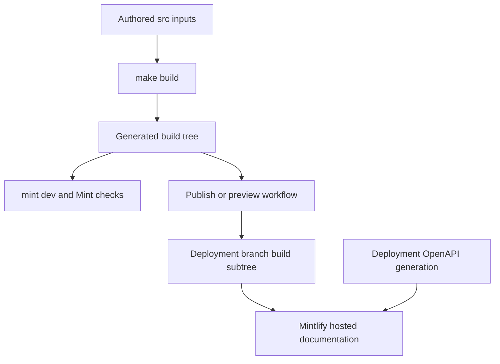

# Mintlify Integration

Mintlify is the renderer-facing consumer of this repository's generated `build/` tree. Authors edit `src/`; the documentation builder clears and recreates `build/`, where it places transformed MDX, `docs.json`, styles, assets, fonts, snippets, and generated LLM artifacts. Treat that output as disposable—not as an authoring location or a durable route inventory.



This diagram shows the renderer handoff: source becomes a disposable tree before local rendering or branch-based publication, while OpenAPI endpoint pages are added at the Mintlify deployment boundary.

## Renderer contract: `src/docs.json`

Mintlify is the static site generator responsible for rendering the built documentation from /build/ into docs.langchain.com. The LangChain documentation pipeline produces markdown and MDX output in /build/, and Mintlify reads this output along with site configuration from docs.json to render the final site.

`src/docs.json` is copied to `build/docs.json` as a shared input. It is therefore the renderer-facing contract for site identity, navigation and routes, rather than a build-system source map. It defines the Aspen theme, logos and favicon, Tabler icons, color and appearance choices, code-block themes, Google Tag Manager, canonical SEO metadata, the banner, navbar/footer links, contextual actions, 404 behavior, and redirects. A navigation entry must name a page that the builder actually emits at the stated path.

Site configuration is defined in /src/docs.json (copied to /build/docs.json) using Mintlify's docs.json schema, specifying navigation menus, theme (aspen), fonts (TWK Lausanne for headings, Inter for body), icons (Tabler library), colors, analytics (Google Tag Manager), contextual actions, and URL redirects.

The aspen theme is customized with TWK Lausanne (weight 700) for headings loaded via docs.json, additional font weights declared in /src/style.css via @font-face rules, and Inter for body text. Custom CSS in /src/style.css overrides Mintlify defaults and is injected into page headers via docs.json. The `head` array also loads `ChatLangChainEmbed.js`, so visual or header-resource changes should be checked through Mintlify, not merely by inspecting source files.

Mintlify renders contextual actions defined in docs.json including built-in options (copy, view) and custom integrations (llms.txt, ChatGPT, Claude, MCP, Cursor, VSCode). These appear in the page header for users to access documentation in external tools or copy URLs.

### Navigation and route changes

`navigation.products` owns the rendered product menu. In **PRODUCTS AND SETUP**, the current top-level entries are **LLM Gateway**, **No-code agents** (the Fleet source family), **Engine**, and **Deep Agents Code**. The Gateway entry has direct overview, quickstart, and API-format pages plus Core capabilities, Administration and governance, and Advanced groups. Fleet is organized into Get started, Configure, Tools and automation, Advanced, and Additional resources; Engine is a flat list of its overview, workflow, integration, category, webhook, security, and self-hosted pages.

The current docs.json product menu gives LLM Gateway, No-code agents, Engine, and Deep Agents Code separate entries; Deep Agents Code is an unversioned OSS section whose expanded Configuration group defines a root and child pages.

This distinction affects safe changes. The builder produces most OSS pages under language-specific `oss/python/` and `oss/javascript/` paths, but Deep Agents Code is emitted once at `oss/deepagents/code/`. Its paths are excluded from OSS language-link rewriting. Managed Deep Agents follows the inverse special case: it emits Python and JavaScript routes, and its unversioned legacy paths redirect to Python. Update the source page, the navigation path, the output-routing expectation, and any redirect together; a `docs.json` edit alone does not create a page.

The redirects array in docs.json maps deprecated or reorganized routes to canonical pages, including former LLM Gateway paths and explicit unversioned Managed Deep Agents paths to their Python routes.

## OpenAPI and reference ownership

OpenAPI endpoint documentation is not local MDX output. Mintlify reads three `docs.json` OpenAPI sections during deployment and generates their endpoint routes. Those deployment-generated routes must remain distinct from both locally emitted files and the separately operated SDK reference site at `reference.langchain.com`.

| Mintlify section | Input lifecycle | Generated route boundary |
| --- | --- | --- |
| Agent Server API | Committed `src/langsmith/agent-server-openapi.json` | `langsmith/agent-server-api` |
| Control Plane API | Remote `https://api.host.langchain.com/openapi.json`, fetched at deployment | Mintlify default `/api-reference/` |
| LangSmith REST API | Committed `src/langsmith/langsmith-platform-openapi.json` | `langsmith/smith-api` |

Mintlify is configured with three OpenAPI sections: committed Agent Server and LangSmith REST specifications generate under langsmith/agent-server-api and langsmith/smith-api, while the Control Plane specification is fetched from https://api.host.langchain.com/openapi.json at deployment. The LangSmith REST specification is refreshed daily through a standing update PR workflow.

The scheduled refresh runs `scripts/process_langsmith_openapi.py --write`, which fetches the allowed LangSmith service host and shapes the committed REST spec for public documentation by hiding selected fleet/internal/health endpoints and adding human-readable group metadata. It reuses `chore/refresh-langsmith-openapi` while its PR is open and exits without a commit if the processed file has not changed. Do not hand-edit that generated spec; review the automated diff. Do not copy the remote Control Plane input into the repository or hand-author Mintlify endpoint pages.

Mintlify deployment generates endpoint routes for the configured OpenAPI sections, so those routes are absent from local build output and are intentionally filtered from local Mint link checking.

`make check-openapi` rebuilds first, then runs `mint openapi-check langsmith/agent-server-openapi.json` from `build/`. Despite its general name, it validates only the local Agent Server input; it does not prove remote Control Plane availability or deployment-time route generation.

## Local rendering and validation

The development workflow uses mint dev CLI (a separate global npm binary installed via npm install -g mint@latest) running in the /build/ directory on port 3000. The docs dev command in pipeline/commands/dev.py orchestrates file watching via FileWatcher and launches mint dev as an async subprocess.

`make dev` installs project npm dependencies and runs the pipeline command. Unless `--skip-build` is supplied, it first performs a full build; it then watches `src/`, starts `mint dev --port 3000` in `build/`, forwards child-process output, and tears down the watcher and process on interruption. A failed initial build prevents startup. An unexpected watcher termination or nonzero Mint exit makes the command fail.

For rendered-tree checks, run:

```bash
make broken-links
make broken-links-with-anchors
```

The Mint link-check targets run in build/ after building, filter deploy-time OpenAPI pages and standalone-snippet false positives, and fail only for remaining actionable link entries. The reusable link-check workflow uses Node 22 and runs the anchor check plus the Agent Server OpenAPI validation.

The filter removes only documented non-local destinations—Agent Server, LangSmith REST, and Control Plane OpenAPI routes—entire standalone `snippets/` report sections, selected legacy relative paths, and, for anchor checks, three known SmithDB migration anchors. It is deliberately narrower than a blanket ignore list: remaining indented report entries fail the target.

Snippet imports in MDX files are expanded by Mintlify at render time; they are not served as standalone pages. The build system processes snippets and stores language-specific versions at /build/snippets/{python|javascript}/, and Mintlify inlines them into importing pages.

## Offline export

```bash
make export
make htmltest
# or
make export-htmltest
```

The make export target builds the generated documentation and runs mint export from build/, producing build/export.zip by default. It requires a recent Mint CLI with export support, Node LTS 20 or 22, and an Enterprise Mintlify plan.

Offline export validation unpacks the Mint archive and intentionally uses htmltest only for external URLs because Mintlify export does not emit a complete page set; internal and internal-hash checks are disabled. It still checks configured external links and other HTML resources, but a passing export check is not proof that internal navigation works; use the Mint generated-tree checks for that.

## Publication and previews

The production workflow runs on pushes to `main` and manual dispatch. It builds the documentation, verifies `build/` exists, copies it to `public/build`, and publishes `public` to the `prod` branch with `peaceiris/actions-gh-pages@v4` and `GITHUB_TOKEN`. The nested `build/` layout is intentional: it is the published renderer input, not a committed source tree.

The preview workflow is separate from production publication. It runs the creation path only for same-repository pull requests or manual dispatches, rejecting closed events and avoiding fork PRs that lack branch-write authority. It validates and sanitizes the source branch, builds documentation, creates a collision-resistant `preview-<prefix>-<timestamp>-<sha>` branch, force-adds `build/`, and pushes it. Its downstream job requires `MINTLIFY_API_KEY`, `MINTLIFY_PROJECT_ID`, and the generated branch name before posting to Mintlify's preview API; malformed JSON or an API error without a status or preview URL fails the job. On pull requests it comments with the resulting preview information. Closing a pull request triggers cleanup only for matching `preview-` branches.

The preview workflow builds artifacts for same-repository pull requests, pushes them to a preview branch, and invokes Mintlify's preview API only after validating the required API key, project ID, and branch name; closed pull requests trigger preview-branch cleanup.

## Operational checklist

1. Change `src/` inputs, particularly MDX, `src/docs.json`, assets, or `src/style.css`; never patch `build/`.
2. For a new or moved route, reconcile the builder's emitted path, the appropriate `docs.json` navigation group, and legacy redirects.
3. Run `make build`, then use `make dev` to inspect renderer-facing configuration and content.
4. Run `make broken-links-with-anchors` for navigation, routes, snippets, and reference changes; run `make check-openapi` for Agent Server spec changes.
5. Keep deployment-generated OpenAPI routes separate from local files and external SDK reference docs. Validate remote Control Plane behavior and generated endpoint routes through deployment or preview.
6. Use preview branches for eligible internal PRs; production publication comes from the `main`-triggered workflow.

## Related concepts

- [Build system](/openwiki/architecture/build-system.md) — generated-tree lifecycle and output routing.
- [Source map](/openwiki/architecture/source-map.md) — source paths, URLs, and navigation ownership.
- [GitHub Actions](/openwiki/integrations/github-actions.md) — CI trust boundaries and scheduled automation.
- [Reference documentation](/openwiki/integrations/reference-docs.md) — SDK-reference versus OpenAPI ownership.
- [Adding pages](/openwiki/operations/adding-pages.md) — navigation and route-change procedure.
