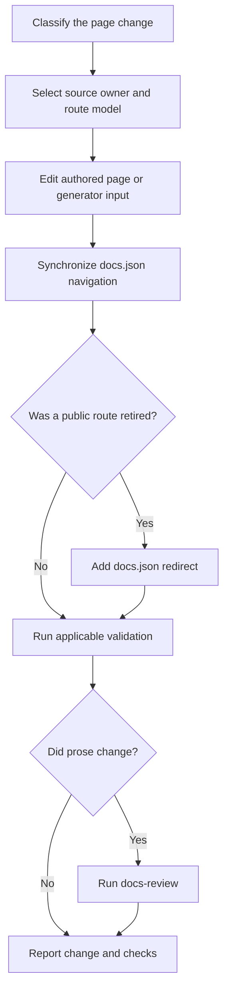

# Adding and Maintaining Documentation Pages

A documentation change is complete only when its owning surfaces agree: editable page inputs live under `src/`, `src/docs.json` owns navigation and redirects, and the pipeline derives `build/`. Never repair a preview by editing `build/`; change its input and regenerate it.



This lifecycle shows the required synchronization points. A source file alone is not a finished public page, and a generated file is not an editable owner.

## Select the applicable authoring procedure

Use the task-specific skill before making the change:

| Situation | Procedure |
| --- | --- |
| Add, move, rename, delete, navigate, or redirect a page | Use `add-docs-page`. It defines source selection, navigation, redirect, and verification requirements. |
| Revise an existing page or a page on an open pull request | Use `docs-edit`. For a named PR, work on its existing head branch, inspect the live diff, and verify factual statements against implementation rather than sibling documentation. |
| Draft or substantially revise prose | Use `docs-team-voice` together with `AGENTS.md`. It covers readable, evidence-based prose; Vale enforces lintable style rules. |
| Review completed prose | Run `docs-review` after editing and before committing. It reviews the changed Markdown and MDX scope, not `build/` or unchanged page text. Skip it for a configuration-only change with no prose. |

Repository-wide rules and the current navigation map live in `AGENTS.md`; procedures live in `.agents/skills/`. Claude Code reads the linked `.claude/skills/` tree, which `make skills` creates from that source. If a change adds or changes documentation tooling, such as a script, workflow, Make target, check, scheduled job, or skill, also invoke `docs-tooling-notion` before handoff.

## Choose the source owner and public route

Choose by route and language behavior, not by a navigation label. The navigation deliberately uses labels that differ from directories, such as **No-code agents** for `src/langsmith/fleet/`. `src/docs.json` defines two products containing menu items; items can contain direct pages, tabs, dropdown tabs, and nested `pages` groups. It is the authoritative placement and route map.

| Content | Editable owner | Public route behavior | Placement rule |
| --- | --- | --- | --- |
| Shared OSS content | Most of `src/oss/` | Separate `/oss/python/...` and `/oss/javascript/...` routes | Author one shared page. Use `:::python` and `:::js` only where content differs, then add both route entries. |
| Language-specific OSS content | `src/oss/python/` or `src/oss/javascript/` | Matching language route only | Add the matching language navigation entry. |
| OpenWiki | `src/oss/openwiki/` | One unversioned `/oss/openwiki/...` route | Use the unprefixed route in navigation and links. |
| Deep Agents Code | `src/oss/deepagents/code/` | One unversioned `/oss/deepagents/code/...` route | Use the unprefixed route in navigation and links. |
| Ordinary LangSmith content | `src/langsmith/` | One `/langsmith/...` route | Place it in the appropriate lifecycle or setup location. |
| Managed Deep Agents | Direct `src/langsmith/managed-deep-agents*.mdx` files | Python and JavaScript `/langsmith/...` routes | Add both language entries and preserve needed legacy redirects. |
| Reusable content | `src/snippets/` | Imported into a consuming page, not a standalone page route | Extract a repeated block once it appears on three or more pages. |
| Runnable example | `src/code-samples/` | Generator input for snippet MDX | Test the sample and regenerate derived snippets. |

The builder clears `build/`, produces normal OSS variants for Python and JavaScript, then produces unversioned OpenWiki and Deep Agents Code content and unversioned LangSmith content. Managed Deep Agents pages are a LangSmith exception that emit only language-prefixed variants. Conditional fences retain only the selected language during preprocessing. Links to ordinary shared OSS content are rewritten for the target language, but OpenWiki and Deep Agents Code routes are excluded from that rewrite. Consequently, link to those products with unprefixed routes; an unqualified ordinary OSS link from an unversioned page resolves to the Python variant.

## Add or revise an authored page

Inspect neighboring files and the corresponding `docs.json` location first. Preserve local structure unless the task explicitly requests restructuring.

1. Create or edit the `.mdx` or `.md` file under its selected owner. New MDX requires plain-text `title` and `description` frontmatter. Do not use Markdown, links, or backticks in `description`.
2. Add the extensionless route to the correct `pages` array in `src/docs.json`. Do not include `src/` or the extension: `src/langsmith/sandboxes.mdx` becomes `"langsmith/sandboxes"`.
3. Add both entries for shared versioned OSS or Managed Deep Agents content. A language-specific page needs only its matching entry. Put an index route first in a new group.
4. For an integration page, add it to the component `index.mdx`; edit `docs.json` only when creating a new component group.
5. Use root-relative public routes for internal links. Do not hard-code `/python/` or `/javascript/`; the build selects ordinary OSS variants. Use `@[Name]` only for eligible first API-reference mentions, then run `make check-cross-refs`.
6. Before rewording a heading, search inbound `#anchor` links. A changed heading changes its slug. Update callers or provide a landing redirect where appropriate; `<Step>` and `<Accordion>` can retain a landing point with an explicit `id`.

## Change generator inputs, not generated results

Some committed files under `src/` are generated artifacts. Their presence under `src/` does not make them manual owners.

- **Code samples:** Edit and test `src/code-samples/`, then run `make code-snippets`. It extracts content into `src/code-samples-generated/` and `src/snippets/code-samples/`.
- **Integration tables:** Hosted guide `integration` frontmatter and `scripts/data/integration_external_docs.yaml` are inputs. Refresh generated tables after changing either:

  ```bash
  uv run python scripts/refresh_integration_downloads.py --write
  ```

  Validate an external `docs_url` before changing it:

  ```bash
  uv run python scripts/refresh_integration_downloads.py --check-docs-urls
  ```

  External records use their `docs_url` as the rendered link. The generator permits `https://`, `http://`, and single-slash site-relative URLs, and rejects protocol-relative or unsafe schemes.
- **Managed Deep Agents OAuth catalog:** Prose belongs in `src/langsmith/managed-deep-agents-connections.mdx`; it imports the generated `src/snippets/langsmith/mda-oauth-catalog.mdx`. Upgrade the installed CLI and regenerate the table, rather than editing its output:

  ```bash
  uv tool upgrade --pre managed-deepagents
  uv run python scripts/refresh_mda_oauth_catalog.py --write
  ```

  The generator reads `mda connections catalog --json`, writes the table only, and refuses a destination outside the repository.

## Move, rename, or remove a page

A source move is also a route migration. Start with the mover preview:

```bash
uv run docs mv src/langsmith/evaluation.mdx src/langsmith/deploy/evaluation.mdx --dry-run
```

After reviewing the preview, rerun without `--dry-run`. The `docs` console script invokes `pipeline.cli:main`; its mover scans Markdown, MDX, and notebook Markdown cells under `src` for links to the old file, updates eligible relative links, moves the file, and recalculates its internal relative links. It skips external, mail, absolute, and in-page-only links. A dry run makes no changes; a real move appends to `link_changes.jsonl` before moving the source. The mover does not update `src/docs.json`, redirects, or arbitrary route text, so inspect the diff and search for the old public route.

Update the navigation entry in the same change. When a publicly reachable route is retired, add a redirect in `src/docs.json` using site paths:

```json
{
  "source": "/langsmith/evaluation",
  "destination": "/langsmith/deploy/evaluation"
}
```

Use language-prefixed sources for retired versioned OSS routes. A shared OSS or Managed Deep Agents move can need one redirect per former language route. A regrouping that retains the same emitted route does not need a redirect. For a deletion, select the closest useful successor.

`scripts/check_removed_pages_redirects.py` verifies that every navigation path maps to an existing `.mdx` or `.md` source, including shared-source mappings for Python and JavaScript routes. It compares base and proposed navigation. If a removed page no longer has source, it requires a redirect whose source matches directly or through a `:path*` family wildcard. Removing navigation while retaining the source is the exception that does not require a redirect.

## Validate in dependency order

Use output to validate inputs, not as an editable source. The baseline for a new, moved, renamed, deleted, or structurally changed page is:

```bash
make lint_prose FILES="src/path/to/page.mdx"
make build
make broken-links-with-anchors
```

`make build` performs a clean full-tree build. `make broken-links-with-anchors` depends on that build, invokes Mintlify in `build/`, checks fragments, and filters known OpenAPI and standalone-snippet false positives. Indented result lines remain real failures. Use `make broken-links` when anchors did not change.

For interactive rendering, run `make dev` and inspect <http://localhost:3000>. It first builds unless `--skip-build` is supplied, watches `src/`, and runs `mint dev` from `build/`. Use a clean `make build` for structural work rather than relying solely on an incremental preview.

Add focused checks when their trigger applies:

- Run `make check-cross-refs` after adding or changing `@[...]` references.
- Run `make test-code-samples FILES="..."` before regenerating changed runnable examples with `make code-snippets`.
- Run `--check-docs-urls` and refresh integration tables after integration metadata changes.
- Run focused pytest when changing the builder, mover, redirect check, watcher, or generator behavior.
- Run `docs-review` only after prose is complete. Provide the source/configuration diff, commands run, results, and checks not run at handoff.

## Completion checklist

- [ ] The applicable authoring skill was used, and the page's source and route model were selected before editing.
- [ ] Authored content or generator inputs changed under `src/`; `build/` and generated outputs were not hand-edited.
- [ ] A new, moved, or removed page synchronized source, `src/docs.json` placement, and redirects for every retired public route.
- [ ] Versioned, unversioned, and special Managed Deep Agents routes have the required navigation entries.
- [ ] Inbound anchors and mover changes were reviewed when a path or heading changed.
- [ ] Derived samples, snippets, and tables were regenerated through their owning inputs.
- [ ] Prose, build, links, anchors, references, and focused tests were run as applicable.
- [ ] Finished Markdown or MDX prose received a diff-scoped `docs-review` review.

## See also

- [Source directory map](/openwiki/architecture/source-map.md)
- [Language versioning strategy](/openwiki/concepts/versioning.md)
- [Mintlify integration](/openwiki/integrations/mintlify.md)
- [Agent authoring skills](/openwiki/operations/agent-skills.md)
- [Documentation quickstart](/openwiki/quickstart.md)
- [Testing overview](/openwiki/testing/test-overview.md)
