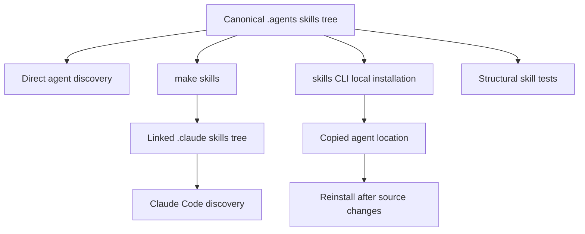

# Agent Authoring Skills

Repository skills are focused, on-demand procedures. They make recurring documentation work repeatable without putting every procedure into every agent context. Universal repository constraints remain in `AGENTS.md` and its identical compatibility copy `CLAUDE.md`.

## Canonical tree and distribution

`.agents/skills/` is the canonical tracked skill tree. Each skill is a directory with a `SKILL.md` in the [Agent Skills](https://agentskills.io) format: YAML frontmatter for discovery followed by Markdown instructions. The directory and frontmatter `name` identify the same skill.

Cursor, Codex, GitHub Copilot, Gemini CLI, OpenCode, Deep Agents, Droid, Kilo Code, and other supported agents discover that tree directly after cloning. Claude Code discovers `.claude/skills/` instead. That gitignored directory is a local distribution surface, not a second source of truth. Create or reconcile it with:

```bash
make skills
```

The target creates the destination if needed, symlinks canonical skills, preserves a non-symlink personal entry, and removes a stale symlink whose source disappeared. Links keep canonical edits live; rerun it after pulling a skill addition or rename. For agents using a different location, the `skills` CLI copies a local source. Its update operation does not refresh local-source copies, so reinstall after source changes or use symlinks.



This flow distinguishes the tracked source from linked and copied distribution surfaces.

## Separate global instructions from skill procedures

`AGENTS.md` is the authoritative global guide, and `CLAUDE.md` is its byte-identical compatibility copy. The `check-agents-sync` workflow runs for pushes to `main` and pull requests that change either file; its `diff` check fails on any difference.

The root guide also calls out manually maintained derived instruction files. The style-guide section is mirrored into `.cursor/rules/docs-style.mdc` and `.github/instructions/docs-style.instructions.md`, which are scoped to `src/**/*.mdx`. Critical rules, repository structure, quick reference, frontmatter, and syntax are summarized in `.cursorrules` and `.github/copilot-instructions.md`. Update applicable derived copies in the same PR. CI enforcement is narrower: it checks only `AGENTS.md` against `CLAUDE.md`, not the scoped mirrors or summary files.

Always-on files consume context on every task. A skill exposes its description for matching and loads its body only when invoked. Put constraints that apply to every edit, such as source layout, frontmatter, navigation, and style rules, in the global guide. Put a conditional multi-step procedure, its tools, decision points, and verification in one focused skill. Skills should link back to shared guidance instead of creating another copy that can drift.

| Surface | Responsibility |
| --- | --- |
| `AGENTS.md` and `CLAUDE.md` | Global constraints and repository orientation. |
| `.agents/skills/<name>/SKILL.md` | One task-specific procedure. |
| Scoped and compatibility instruction files | Manually maintained derived views for a tool or file scope. |

## Select the right skill

The catalog separates page lifecycle, in-place editing, cross-page ownership, authoring and review, runnable samples, factual verification, internal tooling, and integration workflows.

| Skill | Use it for | Key boundary |
| --- | --- | --- |
| `add-docs-page` | Add, move, rename, or delete pages | Owns navigation, redirects, anchor and snippet traps, then hands finished prose to `docs-review`. |
| `docs-edit` | Revise a named page, branch, or open PR | Preserves existing PR branch ownership. |
| `docs-restructure` | Simplify or consolidate material across a page family | Decides whether content is on the right page and assigns one home per topic. |
| `docs-team-voice` | Draft or revise prose | Provides editorial judgment beyond mechanical linting. |
| `docs-review` | Review changed prose | Reviews the diff, not unrelated page content. |
| `docs-code-samples` | Move inline samples into external runnable files | Handles snippet extraction and language-specific sample layout. |
| `verify-against-source` | Verify a sample, signature, default, or behavior claim | Uses executable or implementation evidence instead of other documentation. |
| `docs-tooling-notion` | Record changed team tooling in Notion | Routes each topic to one Notion owner without copying repository procedures. |
| `submit-integration` | Process a new structured integration issue | Runs non-interactively in the authorized automation path. |
| `update-integrations-prs` | Reconcile an existing integration PR with policy | Is separate from new integration intake. |

Changing a script, workflow, Make target, PR check, scheduled job, agent, skill, or MCP server also triggers `docs-tooling-notion` before PR handoff. This is a documentation responsibility of shipping tracked tooling, not an optional request.

## Apply the documentation workflows

### Page lifecycle and restructuring

`add-docs-page` treats an MDX file as incomplete until its navigation entry exists; moving or deleting a shipped page also needs redirects. It directs authors to use the source-directory map, place language-versioned pages in both Build dropdowns, run the repository mover for existing pages, and verify with prose, build, and anchor-aware link gates. A heading change can change its slug, so inbound anchors require a search before rewording. Repeated blocks on three or more pages should become snippets.

`docs-restructure` starts earlier than page lifecycle mechanics: establish the reader-facing page family from navigation, map duplicated content by searching distinctive terms, and report that map before editing. Choose one owner for each topic, usually retaining the most-linked URL. Delete a duplicate and replace it with a pointer rather than relocating or hiding it. Resolve contradictory copies against product source before deleting either one. Then use `add-docs-page` for redirects, navigation, and inbound-link mechanics. Keep the sweep within the named page family unless the requester approves expansion, and report what was deleted, moved, and added with before-and-after line counts.

### Existing pull requests and source verification

`docs-edit` prevents a second PR for work that already has an owner. For a named PR, start clean, check out its head branch, confirm `HEAD` and upstream, and use `gh pr checkout <n>` for a forked PR. Inspect `gh pr diff <n>` rather than comparing against a potentially stale local `main`. Keep edits in place, lint changed prose, check links when URLs or navigation changed, and report the branch and any unverified facts without pushing unless requested.

Use `verify-against-source` when prose asserts behavior. Its evidence ladder favors running the complete sample, then the API-key-free portion, reading implementation source, checking the installed package, and finally looking up a signature. It identifies the repository that owns each product and warns that a self-hosted LangSmith claim can require both Helm-chart and backend evidence. A sibling documentation page is not evidence. Record the inspected file and symbol, and state verification gaps rather than retaining a plausible but unverified assertion.

### Voice and review

`docs-team-voice` complements the global style guide and Vale. It targets a 13-to-15-word median sentence, treats 25 words as a split cue and 35 as a defect, asks authors to link first mentions, state conditions before behavior, state defaults directly, name exact identifiers, and use verified concrete examples. Its revision pass removes filler and hedging, checks repeated or missing links and unsupported claims, then runs `make lint_prose`.

`docs-review` is the diff-scoped review procedure. It resolves a PR, branch, working tree, or current branch, excludes generated `build/` content, and stops when no documentation file changed. It runs Vale on the changed content and the merge-base version to distinguish new blockers from existing debt. Because Vale misses JSX components and table cells, the skill also checks relevant mechanical rules there. The remaining review is limited to style-guide structure, source-aware conventions, and mechanics implied by the diff; findings name the applicable rule rather than proposing unrelated rewrites.

### Notion tooling records

`docs-tooling-notion` requires `notion-fetch` and `notion-update-page`. It searches the other four Docs Team pages before choosing exactly one home: the parent directory, production tech stack, local setup and quality gates, automation and agents, or reference docs. Repository-owned materials and complete skill procedures stay in the repository; Notion should only identify a skill and provide enough context to decide whether to open it.

Fetch immediately before every Notion edit and use narrow `update_content` replacements with exact stored indentation. Do not use `replace_content` on a page with an uploaded image. Since async or timed-out updates may already have applied, fetch and verify before retrying. New workflows, scripts, skills, agents, MCP servers, and git hooks also need a deduplicated row in the parent Detailed list, with its documentation page, source paths, and type. Update the parent page table and stale related links when ownership changes.

### Integration automation

Deep Agents discovers `submit-integration` from `.agents/skills/` with precedence over the former `.deepagents/skills/` location. The integration-submission workflow starts only from a maintainer-applied `integration-run` label or manual dispatch, authorizes the actor, parses the issue form, and passes the resulting JSON to the agent as untrusted listing metadata. The skill makes best-effort, non-interactive listing decisions and leaves changes uncommitted. The workflow owns blocker and failure reporting, no-change handling, and review PR creation.

## Add or change a skill safely

Create `.agents/skills/<name>/SKILL.md` with a kebab-case directory and identical frontmatter `name`. Write a request-oriented description because it is the discovery signal. Keep the body to one cohesive workflow; split unrelated procedures. Only supported frontmatter keys are accepted, and `description` is required with a maximum of 1,024 characters.

Validate the canonical tree, not Claude's symlink distribution:

```bash
claude plugin validate .agents/skills --strict
```

The validator does not follow Claude symlinks. After adding or removing a skill, update both the README inventory and the `AGENTS.md` Skills table; update `CLAUDE.md` identically whenever the shared global guide changes.

## Verify the structural contract

`tests/unit_tests/test_skills.py` treats the canonical tree as the contract. It validates each child skill directory for `SKILL.md`, parseable frontmatter, a matching kebab-case name, required bounded description, and supported keys. It also checks referenced repository paths under supported roots, referenced Make targets, and exact equality of the canonical directory set with both README and `AGENTS.md` inventories. A stale path or target is harmful because an agent can follow it confidently.

Run the focused check while changing skills or their inventories:

```bash
make test TEST_FILE=tests/unit_tests/test_skills.py
```

A failure points to a concrete repair: malformed or incomplete metadata, a renamed repository interface in a procedure, or a stale catalogue. Run `make skills` separately when Claude Code distribution also needs validation.

## See also

- [Quickstart](/openwiki/quickstart.md)
- [Adding and Modifying Documentation Pages](/openwiki/operations/adding-pages.md)
- [Testing Overview](/openwiki/testing/test-overview.md)
- [GitHub Actions and CI/CD](/openwiki/integrations/github-actions.md)
