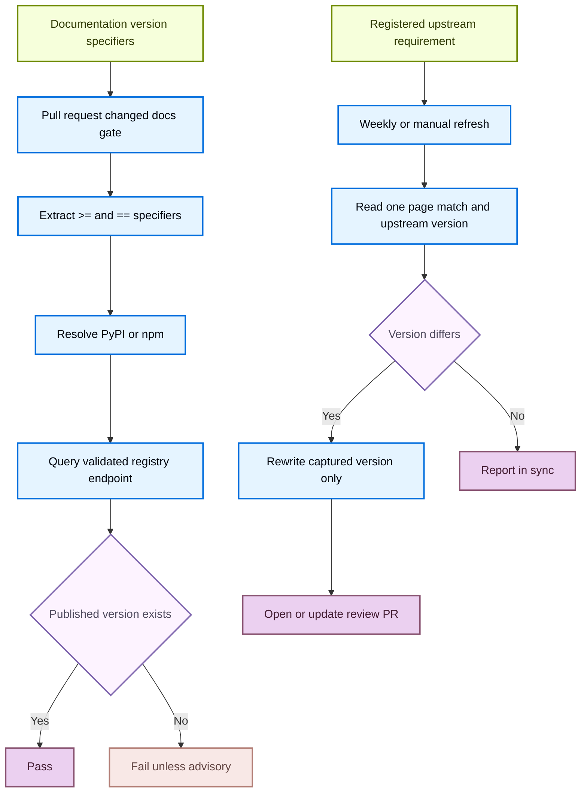

# Version Claim Validation

The repository protects documentation version statements through two deliberately separate checks. `scripts/check_version_claims.py` establishes the narrow fact that a package version named in documentation was published to its registry. `scripts/check_external_versions.py` detects drift only for registered **mirror claims**, where an upstream project owns the requirement and the documentation is meant to repeat it exactly.

Neither mechanism decides that a feature needs a newer minimum version. Registry publication proves only existence, not that a feature floor should be bumped. Likewise, a mirror rewrite updates only a captured version; reviewers must verify that the surrounding upstream requirement, including prerequisites, flags, and peer dependencies, remains true.



This flow distinguishes the literal registry-existence gate from the opt-in synchronization path for upstream-owned requirements.

## Validate published package versions

The version-claim checker scans MDX for package specifiers using `>=` or `==`, collects source locations for each distinct claim, and looks up each distinct package once. It reports up to five locations for an unpublished claim, alongside the registry's latest version. Exact versions must be published; a shortened floor such as `1.1` is accepted when any published release begins `1.1.`. This accommodates series-level floors without accidentally matching a longer prefix such as `1.14.0`.

### Resolve the package ecosystem

A package name can exist on both registries with unrelated release lines, so resolution uses evidence in strict precedence order:

1. An npm `@scope/` prefix selects npm.
2. Python extras such as `langsmith[livekit]` select PyPI.
3. The closest Python or JavaScript label within 40 characters on the same line selects the ecosystem. This takes precedence over a language fence because one unfenced sentence can name both SDKs.
4. An enclosing `:::python` or `:::js` fence selects PyPI or npm.
5. A `/python/` or `/javascript/` page path selects the page default. The `JS_ONLY_PAGES` override handles the flat JavaScript-only `src/langsmith/trace-with-vercel-ai-sdk.mdx` page.
6. Remaining bare specifiers default to PyPI.

The checker accepts only names matching its PyPI or npm allowlists before interpolating them into registry URLs. It requests PyPI's package JSON endpoint or npm's registry endpoint with a 30-second timeout and performs distinct package lookups with at most eight worker threads. Preserve these path, URL, and network-failure safeguards when changing the checker.

### Interpret failures and exceptions

An unsuccessful registry lookup, including a timeout, outage, malformed response, or private package, is an **unresolved note**, not evidence of a nonexistent version. The blocking condition is a successful lookup whose release set does not contain the claimed version or its valid series prefix. `--advisory-only` prints the same findings but always exits zero.

`scripts/version_claims_ignore.txt` holds standing exceptions by literal specifier, without an ecosystem prefix. Blank lines and comments, including trailing comments, are ignored. Each entry needs a reason and should represent a known-good unresolvable value, such as a deliberate “any version” floor or a placeholder package in an example. Prefer correcting an incorrect page rather than adding an exception.

Run the checker from the repository root:

```bash
uv run python scripts/check_version_claims.py
uv run python scripts/check_version_claims.py --files src/langsmith/evaluators.mdx
uv run python scripts/check_version_claims.py --advisory-only
```

With `--files`, only existing `.mdx` arguments are considered; an empty eligible set succeeds with `no .mdx files to check`. Without it, the command recursively scans `src/`. A missing `src/` directory is an error.

## Enforce changed-document claims and sweep the tree

`.github/workflows/check-version-claims.yml` is a read-only pull-request gate for changes to MDX documentation, its checker, its ignore list, or its workflow. It checks out full history, computes the merge base against the PR base branch, and sends changed `.mdx` paths below `src/` to `--files`. When no eligible documents changed, it skips Python setup and the checker. A successfully resolved but unpublished literal version fails this gate; old but published floors do not.

The scheduled `sweep` job in `.github/workflows/refresh-external-versions.yml` complements that narrow PR scope. It scans all pages with `--advisory-only` every Monday and writes its report to the workflow summary. This can expose stale pages that no PR touched without turning the schedule red when a release is yanked or unavailable.

## Synchronize true upstream mirror claims

Registry existence cannot validate requirements such as a CLI or runtime prerequisite. For a requirement that another project owns and the docs intentionally mirror, register it in `scripts/data/external_versions.yaml`. Do not register feature floors there: an upstream release cannot establish when the documented feature landed, and automatically raising that floor could tell readers to upgrade unnecessarily.

Each registry entry has a stable `id`, output `label`, a `page` below `src/`, a page `pattern`, and a `source`. The page pattern and, for `github_file`, source pattern must each expose a named `version` group. The page pattern must match exactly once before a value can be compared or rewritten, which prevents guessing when prose is missing or ambiguous. Supported source types are:

- **`github_file`**: Fetches a file at the upstream repository `HEAD` and extracts its named version group.
- **`github_release`**: Reads the GitHub latest-release API and removes at most one leading `v` from `tag_name`.

The loader rejects malformed registries, unknown source types, missing required fields, unsafe repository slugs, traversal in upstream paths, absolute target pages, and target pages outside `src/`. These constraints matter because `--write` edits the configured page and constructs upstream request URLs. Do not weaken them.

### Check, write, and review

Run a comparison, one registered entry, or a local rewrite with:

```bash
uv run python scripts/check_external_versions.py
uv run python scripts/check_external_versions.py --only codex-cli
uv run python scripts/check_external_versions.py --write
```

Normal check mode exits nonzero if any registered entry drifted or could not be read, including a missing page, a non-unique page pattern, or an unavailable upstream source. Write mode reports those conditions but exits zero so entries that did resolve can reach the refresh pull request. It replaces only the text span captured by the page pattern's `version` group, preserving all other text. That safe rewrite limit is not semantic validation: reviewers must compare the surrounding upstream requirement before merging.

The refresh workflow runs at 08:00 UTC Monday and on manual dispatch with write and pull-request permissions. After `--write`, it creates no change when `src/` is clean. For a diff, it stores a patch, restores the checkout, then applies the patch to the standing `chore/refresh-external-versions` branch when its PR is open, or creates the branch otherwise. A second clean-tree check avoids an empty commit. The resulting PR calls out the required manual review of non-version requirement changes.

## Test and change safely

Focused unit tests cover the behavior most likely to create a false result:

- `tests/unit_tests/test_check_version_claims.py` covers specifier parsing, ecosystem precedence, fence reset, path overrides, exact pins, series matching, ignore parsing, registry payload decoding, and the invariant that unsafe package names never reach the network. It also verifies that a registry outage is unresolved rather than an unpublished version.
- `tests/unit_tests/test_check_external_versions.py` covers unique-match extraction, digit-only rewrite behavior, both upstream source kinds, registry validation, and check versus write failure semantics. Its committed-registry test requires every configured target page to exist and its page pattern to match.

Run either focused test through the socket-isolated unit suite:

```bash
make test TEST_FILE=tests/unit_tests/test_check_version_claims.py
make test TEST_FILE=tests/unit_tests/test_check_external_versions.py
```

When adding an entry, first establish that it is a real equality claim with an upstream owner. Use a stable ID, narrow both patterns so the intended version is unambiguous, and confirm that the page target remains under `src/`. When changing ecosystem heuristics or URL construction, retain the precedence and allowlist tests, and add a regression test for the ambiguous real-world syntax that motivated the change.

## See also

- [GitHub Actions and CI/CD](/openwiki/integrations/github-actions.md)
- [Adding and Maintaining Documentation Pages](/openwiki/operations/adding-pages.md)
- [Agent Authoring Skills](/openwiki/operations/agent-skills.md)
- [Testing Overview](/openwiki/testing/test-overview.md)
