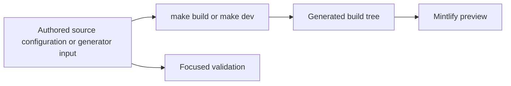

# Quickstart

This repository builds the Mintlify site at [docs.langchain.com](https://docs.langchain.com). `src/` holds authored documentation and `src/docs.json` holds Mintlify configuration, navigation, and redirects; the pipeline recreates the Mintlify-facing `build/` tree. **Never edit `build/`.** The build clears that directory, emits Python and JavaScript OSS variants, emits unversioned OpenWiki and Deep Agents Code content, processes LangSmith and Managed Deep Agents content, then copies shared files. API reference at [reference.langchain.com](https://reference.langchain.com/python/) is generated outside this repository; report a problem through its [reference-docs issue template](https://github.com/langchain-ai/docs/issues/new?template=04-reference-docs.yml).



The flow shows the ownership boundary: edit inputs and validate the changed contract, but treat the preview tree as disposable output.

## Set up and preview

The checkout requires Python 3.13 or later, Node.js, and `uv`.

```bash
git clone https://github.com/langchain-ai/docs.git
cd docs
make install
make dev
```

`make install` synchronizes all Python dependency groups, installs project npm dependencies and the global Mintlify CLI, and links skills for Claude Code. Open <http://localhost:3000>. `make dev` performs an initial build, watches `src/`, and runs `mint dev --port 3000` from `build/`; it exits instead of serving stale output if the initial build fails. Use `uv run pipeline dev --skip-build` only when an existing build tree is suitable; the command warns when it is absent. Use `make build` for a clean one-shot reconstruction and inspect every affected emitted route.

## Start with instructions, then route the task

Read `AGENTS.md` before changing the repository. It is byte-identical to `CLAUDE.md` and contains universal authoring rules. Task-specific procedures are canonical `SKILL.md` files in `.agents/skills/`; most listed agents discover that tree directly. Claude Code uses the linked `.claude/skills/` tree, so run `make skills` after pulling a skill addition or rename.

| Task | Authoritative starting point | Read next | Finish with |
| --- | --- | --- | --- |
| Add, move, rename, retire, or redirect a page | Page source, `src/docs.json`, and redirect configuration | [Adding and Maintaining Documentation Pages](/openwiki/operations/adding-pages.md) | Build and inspect the new, moved, or retired route. |
| Choose a source directory or language route | Source ownership rather than a navigation label | [Source Map](/openwiki/architecture/source-map.md) and [Writing Versioned Content](/openwiki/workflows/versioned-content.md) | Check every expected Python, JavaScript, unversioned, or Managed Deep Agents output. |
| Change navigation, site settings, redirects, Mintlify components, or OpenAPI configuration | `src/docs.json` and its referenced source/configuration | [Adding and Maintaining Documentation Pages](/openwiki/operations/adding-pages.md) | Build; run the relevant Mintlify or link check. |
| Change build routing, preprocessing, emitted artifacts, or a generator | `pipeline/` implementation or generator input | [Build System Architecture](/openwiki/architecture/build-system.md) | Focused unit tests, then build and inspect the affected output. |
| Change a workflow, CI gate, scheduled job, or automation failure | The workflow and invoked script | [GitHub Actions and CI/CD](/openwiki/integrations/github-actions.md) and [Agent Authoring Skills](/openwiki/operations/agent-skills.md) | Reproduce the specific gate and follow the tooling documentation procedure. |
| State or update a package version in MDX | The supported package registry and the page's language context | [Version Claim Validation](/openwiki/operations/version-claim-validation.md) | Run the package-version checker on the page. |
| Update a version requirement mirrored from another project | Its entry in `scripts/data/external_versions.yaml` | [Version Claim Validation](/openwiki/operations/version-claim-validation.md) | Check the upstream source and review surrounding prose after any rewrite. |
| Add or revise a runnable example | `src/code-samples/` and the `docs-code-samples` skill | [Testing Overview](/openwiki/testing/test-overview.md) | Execute source sample, then regenerate snippet MDX. |
| Diagnose a test, link, cross-reference, lint, or generated-file failure | The failed command and changed boundary | [Testing Overview](/openwiki/testing/test-overview.md) | Run the narrowest matching local check. |

Navigation labels and directories intentionally diverge. In particular, most OSS content produces both language routes, while OpenWiki and Deep Agents Code are unversioned exceptions. `src/docs.json` remains the navigation, site-configuration, and redirect source of truth: synchronize it when a page lifecycle change affects discovery or a retired public URL.

## Change the owner, not a derivative

Do not solve a generated-file diff by editing the derivative:

- **Build output:** change authored content, configuration, metadata, or pipeline code—not `build/`.
- **Provider overview:** `src/oss/python/integrations/providers/overview.mdx` comes from `packages.yml` and `pipeline/tools/partner_pkg_table.py`. Change the input, run `uv run python pipeline/tools/partner_pkg_table.py`, and commit the refreshed output. CI regenerates it and rejects a diff.
- **Runnable snippets:** files in `src/code-samples/` are source. `make code-snippets` extracts them through `src/code-samples-generated/` and generates importable MDX in `src/snippets/code-samples/`; change the runnable source, never either derivative.
- **Other generated listings:** locate the metadata or generator, use its documented regeneration path, and commit the intended regenerated artifact.

For a sample change, execute the narrowest sample before generation:

```bash
make test-code-samples FILES="src/code-samples/langchain/return-a-string.py"
make code-snippets
```

Without `FILES`, the sample runner selects supported Python, TypeScript, Java, Kotlin, Go, and shell files below `src/code-samples/`. Samples run in their actual environment and may need provider credentials or PostgreSQL; never commit credentials. Fork pull requests skip this workflow. Internal pull requests run changed supported samples, while scheduled or manual runs perform full execution, tracing, snippet generation, and trace-refresh pull-request updates after successful steps.

## Validate the boundary you changed

Build and inspect affected routes after an authored page, navigation, shared asset, preprocessing, or route-ownership change. Then add the narrowest check that proves the changed contract.

| Boundary | Command | What it establishes |
| --- | --- | --- |
| Pipeline, parser, watcher, skill, or checker logic | `make test` | Pytest unit tests with network sockets disabled except Unix sockets. Narrow with `TEST_FILE=...`. |
| Finished prose | `make lint_prose FILES="src/path/to/page.mdx"` | Vale using the repository-pinned binary. |
| Python tooling and spelling | `make lint` | Ruff format/check, `ty`, and Codespell. |
| Built links and anchors | `make broken-links-with-anchors` | Fresh build plus Mint's filtered link-and-anchor check. |
| Source `@[ref]` references | `make check-cross-refs` | References against source language-aware maps. |
| Literal package versions in MDX | `uv run python scripts/check_version_claims.py --files src/path/to/page.mdx` | Each successfully looked-up `>=` or `==` version exists on PyPI or npm; this does not prove a feature floor is correct. |
| Upstream-owned mirror requirement | `uv run python scripts/check_external_versions.py --only <id>` | The registered page version matches its GitHub source; use `--write` only to replace captured digits, then review surrounding prose. |
| Runnable sample and generated presentation | `make test-code-samples FILES="..."`; `make code-snippets` | Executable source and refreshed snippet MDX. |

Core CI runs on pushes to `main`, pull requests, and manual dispatch. It invokes unit-test, lint, and link workflows and separately checks merge-conflict markers, source cross-references, external integration documentation URL schemes, and the provider overview's generated-file invariant. The changed-document version gate runs on pull requests that touch eligible MDX or its checker inputs: it checks only changed MDX files and blocks a successfully resolved but unpublished package version; lookup failures are reported as unresolved rather than treated as nonexistent.

A separate trusted weekly (Monday 08:00 UTC) or manual workflow runs `scripts/check_external_versions.py --write`, opening or updating one `chore/refresh-external-versions` pull request when registered mirror versions drift. Its companion full-tree version sweep is advisory, so a registry outage or an old untouched page does not turn the scheduled workflow red. Automated rewrites are proposals for review, not confirmation that surrounding requirements remain valid.

## Before opening a pull request

- Confirm every edit is authored content, configuration, metadata, or a generator—not `build/` or a generated derivative.
- For page lifecycle work, synchronize the page source, exact `src/docs.json` placement, and redirects for retired routes.
- Run `make build` and inspect each route variant the ownership model requires.
- Run focused validation from the table and record any limitation, especially credentials or external services required by samples.
- For a version change, distinguish registry existence from an upstream-owned mirror claim; neither automated check decides a feature's correct minimum version.

## Related pages

- [Build System Architecture](/openwiki/architecture/build-system.md)
- [Source Map](/openwiki/architecture/source-map.md)
- [GitHub Actions and CI/CD](/openwiki/integrations/github-actions.md)
- [Adding and Maintaining Documentation Pages](/openwiki/operations/adding-pages.md)
- [Agent Authoring Skills](/openwiki/operations/agent-skills.md)
- [Version Claim Validation](/openwiki/operations/version-claim-validation.md)
- [Testing Overview](/openwiki/testing/test-overview.md)
- [Writing Versioned Content](/openwiki/workflows/versioned-content.md)
