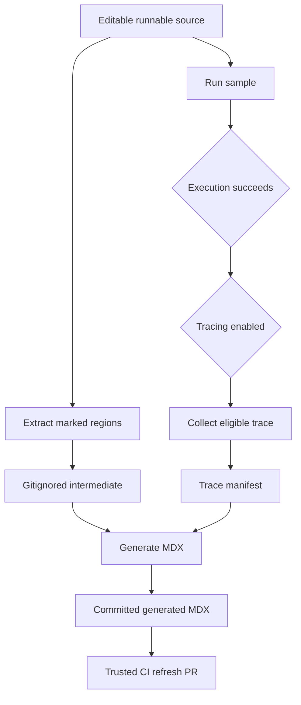

## Purpose and ownership

Runnable documentation examples are authored in supported-language files below `src/code-samples/`. The runnable file is the editable source of truth; `src/code-samples-generated/` is a gitignored extraction intermediate, and MDX below `src/snippets/code-samples/` is a derivative artifact for documentation consumption. Do not hand-edit generated snippet MDX: change the source, run the appropriate checks, regenerate, and review the resulting MDX diff.



This is an ownership and publication flow, not a proof chain: extraction and MDX generation transform marked text only. A successful extraction does **not** demonstrate that the sample ran, that its imports resolve, or that its provider and other external dependencies are valid. Run the source separately; trace sharing is a further, explicit public-publication operation.

## Author source regions

Supported source extensions are `.py`, `.ts`, `.java`, `.kt`, `.go`, and `.sh`. Put a matched `:snippet-start: <id>` / `:snippet-end:` pair in a language-correct comment: `#` for Python and shell, and `//` for TypeScript, Java, Kotlin, and Go. The line-based extractor permits indented markers, strips matched `:remove-start:` / `:remove-end:` regions from a snippet body, dedents and normalizes the extracted body, and fails on an unclosed snippet or remove region. It deliberately recognizes only comment-line markers rather than parsing TypeScript, avoiding parser failures from comment-like content in strings.

A snippet ID must end in the emitted-language suffix: `-py`, `-js`, `-java`, `-kt`, `-go`, or `-sh`. The MDX generator derives its fence language from that suffix and silently skips an intermediate whose ID has the wrong suffix. Use unique, descriptive kebab-case IDs, since each becomes the MDX filename.

Use trailing remove blocks for runnable harness code, assertions, credentials-only setup, or a blocking tail that readers should not copy. They are executed as part of the source but excluded from the generated snippet. Do not terminate before the visible region with `SystemExit`, `process.exit`, or `exit 0`: such a pass can establish only parsing, not that the shown imports, construction, or calls actually executed.

### Scope and layout

One file can hold related regions and one execution harness. TypeScript samples execute as a single module, so visible regions and remove blocks share module scope. Split independently runnable TypeScript examples when they would duplicate imports or top-level bindings. Python can commonly keep related setup and regions in one file; however, a file with multiple snippet markers is ineligible for a public trace link, so split it when independently traceable examples are wanted.

The existing Deep Agents skills examples illustrate this tradeoff: `skills.py` has multiple markers and is recorded as a multi-snippet trace exclusion, whereas the approval, source-composition, and writable TypeScript sources each have one visible snippet and a trailing hidden assertion. The single-snippet LangGraph multiple-schemas TypeScript sample has a manifest trace entry and its generated MDX renders the corresponding `View example trace` card.

### Presentation controls

The optional first line in a snippet may be `:codegroup-tab:`; `:codegroup-fence-mods:` can follow it or be the first line by itself. Generation consumes these directives rather than emitting them and builds the Mintlify fence. For Python and TypeScript, recognized model strings can expand into configured provider CodeGroups; placing `# KEEP MODEL` or `// KEEP MODEL` immediately before a model occurrence preserves it. These presentation transformations do not execute or validate source code.

## MCP structured-content sample

`src/code-samples/langchain/mcp-structured-content.py` is a single-snippet Python source, identified as `mcp-structured-content-py`. Its visible region opens an `MCPAdapter`, lists its tools, constructs a `create_agent("claude-sonnet-5", tools)` agent, invokes it asynchronously, and prints `message.artifact["structured_content"]` only for `ToolMessage` values with a non-`None` artifact.

The source's remove block supplies the runnable harness that the reader does not see: it creates a local FastMCP `get_user` tool returning a record for Alice, runs the async example, and asserts that a tool artifact exists and has `structured_content["name"] == "Alice"`. Thus the committed generated MDX contains only the reusable agent-facing function while the source retains the local server setup and outcome check. The MDX is evidence that the extractor and generator produced the expected visible text; it is not evidence of a successful execution.

The sample has one marker, satisfying the structural trace eligibility rule, but `trace-links.json` has no entry for `mcp-structured-content-py`; its generated MDX accordingly has no trace card. Eligibility is not publication: it still needs a successful traced run that produces a qualifying agent root before the collector shares a public URL.

## Execute and diagnose

During authoring, use a focused run before a wider suite:

```bash
make test-code-samples FILES="src/code-samples/langchain/mcp-structured-content.py"
make test-code-samples
make code-snippets
```

`FILES` accepts a space-separated explicit list. Missing, unsupported, and out-of-tree paths are warned about and skipped; with no list, the runner recursively selects eligible files below `src/code-samples/` in Python, TypeScript, Java, Kotlin, Go, then shell order. It invokes Python via `uv run python`, TypeScript via `npx tsx`, Go via `go run`, shell via `bash`, and Java/Kotlin through JBang on Java 21. TypeScript, Go, and shell run from `src/code-samples/` to resolve shared dependencies.

The runner inherits the environment, so a sample can use credentials and live providers or PostgreSQL. Its timeout defaults to 1,200 seconds and is configurable through `CODE_SAMPLE_TIMEOUT_SECONDS`. Ordinary nonzero exits, timeouts, and trace-collection exceptions fail the runner. A detected LangSmith 429 response is retried three total times with 15-second delays; after that it is recorded as skipped rather than failed. A rate-limit skip is not a successful validation and does not collect a trace.

## Extract and generate

Run the transformation independently of execution with:

```bash
make code-snippets
```

The target first invokes `scripts/extract_code_snippets.py`, then `scripts/generate_code_snippet_mdx.py`. Extraction writes `<source-stem>.snippet.<snippet-id>.<extension>` under `src/code-samples-generated/`, preserving the product subdirectory. Generation scans all supported intermediates, emits language fences or applicable CodeGroups, consults the trace manifest, and writes `<snippet-id>.mdx` under `src/snippets/code-samples/`.

For iteration, `CODE_SNIPPET_SOURCES` can restrict extraction to existing supported sources under `src/code-samples/`:

```bash
CODE_SNIPPET_SOURCES="src/code-samples/langchain/mcp-structured-content.py" make code-snippets
```

A full extraction removes supported intermediates before rebuilding. A partial extraction replaces intermediates only for the selected source stems, but generation still scans all remaining intermediates. Therefore a partial run is an iteration optimization, not proof of complete derived state; use a full regeneration before relying on the full output set.

## Trace publication

`make update-code-sample-traces` enables `CODE_SAMPLE_TRACING=1`, defaults `LANGSMITH_PROJECT` to `docs-code-samples`, runs the samples with LangSmith tracing, and then regenerates MDX. It requires `LANGSMITH_API_KEY`. Since the collector calls LangSmith sharing to create or reuse a public URL, run it only with authorized credentials and with example inputs and outputs suitable for public visibility.

After a successful source execution, the collector counts source markers. No marker gets no link. Exactly one marker is eligible: it polls up to six times, with two-second waits and a two-second start-time buffer, for a root run in the configured project. It prefers agent-like roots and can fall back to a chain root with an LLM child, then shares the selected run and records URL, source, run and trace IDs, name, and update time in `src/code-samples/trace-links.json`. More than one marker records the source in `skipped_multi_snippet` and removes stale per-snippet entries.

During generation, a manifest URL adds or replaces the trailing `View example trace` card; no URL removes a prior trace CTA. This keeps trace association in the manifest rather than in hand-authored MDX.

## CI boundaries and maintenance

The **Test Code Samples** workflow runs for relevant pull requests, manual dispatch, and at 00:00 UTC on the first day of each month. It skips fork pull requests because secrets are unavailable. Internal PRs calculate the merge-base diff and test only changed eligible samples; manual and scheduled runs test all samples. The workflow provisions Python/uv, Node 20, Java/JBang, Go, PostgreSQL, and relevant secrets.

Only manual and scheduled full runs enable tracing. If testing succeeds, CI regenerates snippets and preserves the trace manifest and generated snippet directory while it restores a clean checkout. It opens or updates the deterministic `chore/refresh-code-sample-traces` PR only when either publication artifact differs. Pull-request checks can execute changed sources but do not share traces or publish artifact changes.

A separate observer creates a Linear issue only for failed or cancelled scheduled sample runs. When investigating failures, distinguish ordinary execution failure, rate-limit skip, lack of a qualifying trace, trace-collection failure, and publication diff behavior.

## Change checklist

1. Edit the runnable source under `src/code-samples/`, never the generated MDX as the primary edit.
2. Add matched language-correct markers and a unique ID with the correct language suffix.
3. Keep the visible region executable; put only non-display harness or blocking code in trailing remove blocks.
4. Run `make test-code-samples FILES="..."`; do not infer success from extraction.
5. Run `make code-snippets` and review generated MDX, using a full regeneration before relying on complete output.
6. Use one marker per source when a public trace is desired, and treat `make update-code-sample-traces` as intentional public publication.

## Related pages

- [Preprocessing](/openwiki/concepts/preprocessing.md)
- [GitHub Actions and CI/CD](/openwiki/integrations/github-actions.md)
- [Adding and Maintaining Documentation Pages](/openwiki/operations/adding-pages.md)
- [Testing Overview](/openwiki/testing/test-overview.md)
