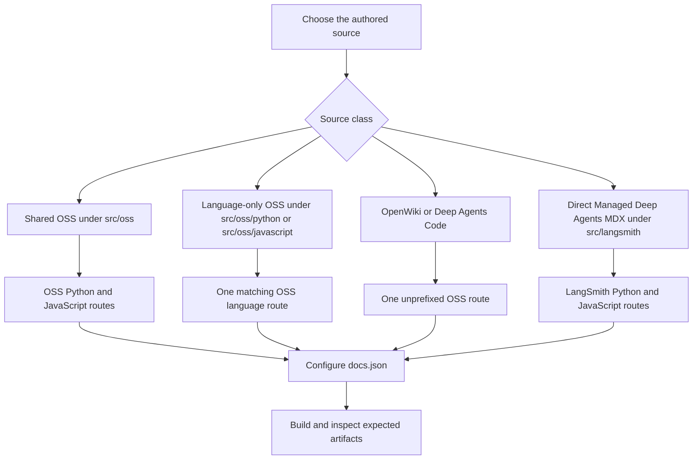

# Writing Versioned Content

Versioned documentation keeps shared prose in one authored source while the builder emits language-specific artifacts. Treat **source ownership**, **emitted routes**, and **navigation or redirects** as separate decisions. Edit `src/` and `src/docs.json`, never `build/`: a full build removes and recreates that output.



This flow separates authored ownership from builder-owned route emission and independently configured discovery paths.

## Select source ownership before choosing a URL

The builder maps its internal `js` target to the public `javascript` URL segment.

| Source ownership | Authored location | Emitted route or routes |
| --- | --- | --- |
| Shared OSS page | Most content below `src/oss/`, such as `langchain/`, `langgraph/`, and `deepagents/` | `/oss/python/...` and `/oss/javascript/...` |
| Language-only OSS page | `src/oss/python/...` or `src/oss/javascript/...` | Only the matching `/oss/python/...` or `/oss/javascript/...` route; the leading source-language directory is removed |
| Language-agnostic product | `src/oss/openwiki/...` or `src/oss/deepagents/code/...` | One unprefixed `/oss/openwiki/...` or `/oss/deepagents/code/...` route |
| Managed Deep Agents page | A direct `src/langsmith/managed-deep-agents*.mdx` file | `/langsmith/python/...` and `/langsmith/javascript/...` |
| Other LangSmith page | `src/langsmith/...` | Its ordinary unprefixed LangSmith route, rendered with the Python target |

Most OSS sources are emitted into Python and JavaScript route trees, while `oss/deepagents/code` and `oss/openwiki` are deliberate single-output exceptions rendered with the Python conditional target. Their own routes stay unprefixed, but an unqualified link to ordinary OSS content resolves to its Python route.

Managed Deep Agents is different from other LangSmith content: its special source must be a direct child of `src/langsmith/` whose filename starts with `managed-deep-agents`. The full-build discovery pass finds `.mdx` files, creates only the two language-prefixed artifacts, and excludes them from ordinary LangSmith output. Although a targeted `build_file()` call recognizes `.md`, use `.mdx` for a page that must be emitted by a normal full build.

Do not create copies under generated `python` or `javascript` paths. For ownership context, see [Source directory map](/openwiki/architecture/source-map.md).

## Write conditional content

Use one shared source for common text and sequential `:::python` and `:::js` blocks only where the content differs. The selected supported-language block is emitted without its markers, the other supported block is removed, and content outside both blocks remains in every artifact.

````markdown
Shared explanation.

:::python
```python
from langchain.agents import create_agent
```
:::

:::js
```typescript
import { createAgent } from "langchain";
```
:::
````

Keep a neutral heading and shared explanation outside branches so both pages remain coherent. Conditional rendering accepts only `python` and `js` targets. It preserves unsupported labels, leaves unmatched openings unchanged, and raises `ValueError` for another target.

### Scope API references to the branch

`@[Name]`, `@[title][Name]`, and backticked forms are resolved **before** conditional rendering. The autolink pass tracks the active `:::language` scope outside ordinary code fences; it leaves an unknown reference in place and logs it rather than failing the build. Put language-dependent references inside their matching branches:

````markdown
:::python
See @[StateGraph].
:::

:::js
See @[StateGraph].
:::
````

Run `make check-cross-refs` after adding or changing an API reference. It is the source-level gate for unresolved names; one rendered artifact can remove the branch that exposes a problem. See [Markdown preprocessing pipeline](/openwiki/concepts/preprocessing.md).

### Avoid fence-parser traps

Conditional rendering is regex-based, not code-fence-aware or nested-block-aware. Do not put live conditional markers inside a normal code fence, and do not nest branches. Escape both markers when documenting the syntax literally:

````markdown
\:::python
This is displayed literally.
\:::
````

Opening and closing markers must have matching indentation. Unsupported labels and unmatched eligible openings remain unchanged, so they are not validation or nesting constructs.

## Author links and snippets for the active variant

For a destination that should follow the current OSS language, author an absolute, unqualified `/oss/...` link:

```mdx
<!-- openwiki: broken internal link [/oss/langgraph/overview] file "/oss/langgraph/overview" does not exist. Fix the href or restore the target, then delete this comment. -->
[LangGraph overview](/oss/langgraph/overview)
```

For a target-language build, this becomes `/oss/python/...` or `/oss/javascript/...`. The rewriter preserves already-qualified routes, paths containing `images`, and the OpenWiki and Deep Agents Code roots. It applies to Markdown links and HTML `href` attributes. Use a qualified route only when the destination must remain fixed to that language.

Bare Managed Deep Agents links follow the same target: `/langsmith/managed-deep-agents...` is rewritten to the selected `/langsmith/python/...` or `/langsmith/javascript/...` route. Keep an already-qualified route when that fixed destination is intentional. The current Managed Deep Agents overview uses this source form in ordinary links, cards, and language-specific conditional content.

Store reusable Markdown or MDX fragments under `src/snippets/` and use a default import from an unprefixed source path in a versioned page:

```mdx
import RequiresLanggraphServer from '/snippets/oss/requires-langgraph-server.mdx';
```

Versioned-page imports of unqualified Markdown snippets are rewritten to `/snippets/python/` or `/snippets/javascript/`; already scoped imports and JSX or TSX component imports are unchanged. Write absolute `/oss/...` links in a shared Markdown snippet instead of fixed relative links.

Markdown snippets are independently preprocessed into Python and JavaScript copies plus a Python-targeted default copy for unversioned consumers. The copies use absolute language-prefixed links, so an importing page can be nested at any depth. When the reusable component itself differs by language, import separate language-specific components and render each in its matching branch, as the Deep Agents quickstart does.

## Configure navigation and redirects separately

A source file and emitted route do not create a visible navigation entry. Add a new route to the appropriate `src/docs.json` product, menu, dropdown, tab, and group, using an extensionless route without `src/`. A language-versioned page needs one entry per route. In the Build menu, Managed Deep Agents has parallel Python and TypeScript dropdown entries, for example `langsmith/python/managed-deep-agents-overview` and `langsmith/javascript/managed-deep-agents-overview`.

A redirect is also independent from source placement and navigation. Add a `redirects` entry in `src/docs.json` for a supported old or alias site path and point it at the canonical route. The unprefixed and legacy Managed Deep Agents paths currently redirect to Python destinations; they are not built as unversioned pages. Do not create an unversioned source copy merely to serve an old URL.

When moving a page, make these decisions explicitly:

1. Keep, move, or split the authored source according to its route class.
2. Confirm every Python, JavaScript, or unprefixed route that should be emitted.
3. Update each navigation entry and retain redirects for public paths that need continuity.

For the navigation procedure and checks for page moves, see [Adding and modifying documentation pages](/openwiki/operations/adding-pages.md).

## Verify both routes and the rendered site

Run a clean build after changing shared source, links, snippets, route rules, navigation, or redirects:

```bash
make build
```

Inspect `build/` only as verification; do not edit it. For shared OSS and Managed Deep Agents content, inspect both language variants. For language-only or unversioned content, inspect the expected route and confirm unexpected sibling variants do not exist.

Then run the rendered-link and anchor check when routes, ordinary links, snippets, or headings changed:

```bash
make broken-links-with-anchors
```

Check all of the following:

1. Each expected route exists with matching conditional content and no opposite branch or selected-block markers.
2. Shared prose appears in every expected variant.
3. Conditional API references resolve in their intended scope.
4. Unqualified OSS links, Managed Deep Agents links, and Markdown snippet imports have the expected language prefix.
5. Fixed-language links, image paths, and unversioned OpenWiki or Deep Agents Code paths remain unchanged.
6. New routes appear in their intended navigation location, and retired paths have either a deliberate redirect or a documented removal decision.

When changing builder behavior, add a focused regression in `tests/unit_tests/test_builder.py`. Assert the emitted location, final transformed contents, and unwanted sibling routes that must be absent. Existing coverage exercises OSS prefix insertion and exemptions, unversioned product output, language-scoped snippets, and Managed Deep Agents dual routes. For fence-focused tests, see [Conditional rendering tests](/openwiki/testing/conditional-rendering.md) and [Builder test guidance](/openwiki/testing/builder-tests.md).

## Checklist

- [ ] Choose the source class before configuring navigation or redirects.
- [ ] Use direct `src/langsmith/managed-deep-agents*.mdx` sources for Managed Deep Agents pages that require full-build output.
- [ ] Keep shared prose outside sequential `:::python` and `:::js` branches.
- [ ] Do not nest conditionals or rely on a code fence to protect live markers.
- [ ] Use unqualified `/oss/...` links only when the destination should follow the active language.
- [ ] Import Markdown snippets unprefixed and use absolute OSS links in shared snippets.
- [ ] Configure navigation and redirects in `src/docs.json` separately from source and route emission.
- [ ] Run `make check-cross-refs` for API references, then build and inspect every expected route without modifying generated artifacts.

## See also

- [Language versioning strategy](/openwiki/concepts/versioning.md)
- [Markdown preprocessing pipeline](/openwiki/concepts/preprocessing.md)
- [Source directory map](/openwiki/architecture/source-map.md)
- [Conditional rendering tests](/openwiki/testing/conditional-rendering.md)
- [Builder test guidance](/openwiki/testing/builder-tests.md)
- [Adding and modifying documentation pages](/openwiki/operations/adding-pages.md)
